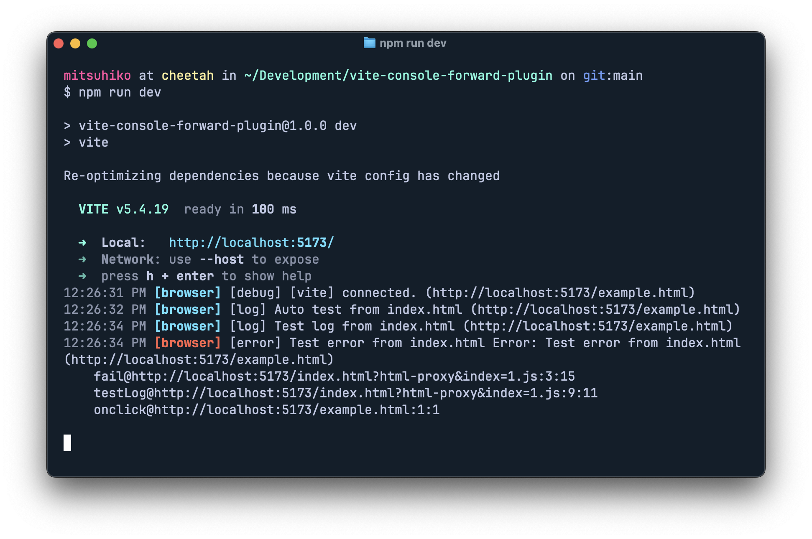

# vite-console-forward-plugin

A Vite plugin that forwards browser console logs to the Vite dev server console for better debugging experience during development.

## What it does

This plugin intercepts browser console logs (`console.log`, `console.warn`, `console.error`, etc.) and forwards them to your Vite dev server console. This is particularly useful when:

- Debugging client-side JavaScript in environments where browser dev tools aren't easily accessible
- You want to see all application logs in one place (Claud Code)
- Working with mobile devices or embedded browsers
- Running automated tests and want console output in your CI logs



## Installation

Since this is a single-file plugin, you can copy `vite-console-forward-plugin.ts` directly into your project, or install it as a local dependency.

## Usage

Add the plugin to your `vite.config.ts`:

```typescript
import { defineConfig } from "vite";
import { consoleForwardPlugin } from "./vite-console-forward-plugin";

export default defineConfig({
  plugins: [
    consoleForwardPlugin({
      // Enable console forwarding (default: true in dev mode)
      enabled: true,

      // Custom API endpoint (default: '/api/debug/client-logs')
      endpoint: "/api/debug/client-logs",

      // Which console levels to forward (default: all)
      levels: ["log", "warn", "error", "info", "debug"],
    }),
  ],
});
```

## Configuration

The `consoleForwardPlugin` accepts an options object with the following properties:

| Option     | Type       | Default                                     | Description                          |
| ---------- | ---------- | ------------------------------------------- | ------------------------------------ |
| `enabled`  | `boolean`  | `true`                                      | Whether to enable console forwarding |
| `endpoint` | `string`   | `"/api/debug/client-logs"`                  | API endpoint path for receiving logs |
| `levels`   | `string[]` | `["log", "warn", "error", "info", "debug"]` | Console levels to forward            |

## How it works

1. **Client-side**: The plugin injects code that patches browser console methods
2. **Buffering**: Console logs are buffered and sent in batches to reduce network overhead
3. **Server-side**: A middleware endpoint receives the logs and outputs them using Vite's logger
4. **Formatting**: Logs maintain their original formatting and include stack traces for errors
5. **Error handling**: Network failures are handled gracefully without breaking your application

## License

MIT
